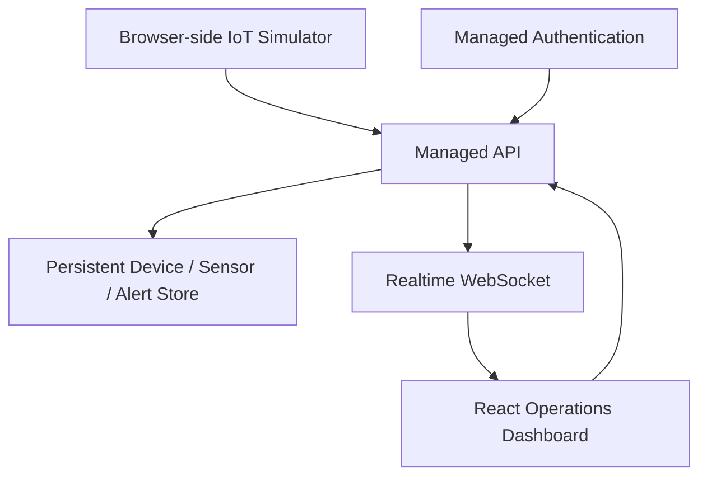

# IoT Command Center — Architecture

## Hosted architecture

The deployed edition uses the AppDeploy managed runtime for the web application, persistent database, authenticated API, and WebSocket realtime layer.

## Data flow

1. Ten simulated devices are seeded on first access.
2. The simulator tick endpoint generates gradual telemetry changes.
3. Readings are persisted and threshold conditions create alerts.
4. The backend publishes a command-center entity update to subscribed WebSocket clients.
5. The dashboard updates without a page refresh.
6. Device commands create operational events and simulator acknowledgements.

## Portfolio/local extension

The original specification calls for Mosquitto/MQTT, PostgreSQL, Redis, FastAPI, Docker Compose, Nginx, Prometheus and Grafana. The hosted AppDeploy runtime does not execute an arbitrary Docker Compose stack or Python worker, so those components are intentionally represented as the local-production extension rather than falsely claiming they are running in the hosted deployment.

For a Linux/Docker portfolio deployment, the next evolution is to replace the simulator endpoint with the specified MQTT topics:
- iot/devices/{device_id}/telemetry
- iot/devices/{device_id}/status
- iot/devices/{device_id}/heartbeat
- iot/devices/{device_id}/command
- iot/devices/{device_id}/response

The UI/API contracts are designed around the same device, sensor, alert, event, and command concepts.
